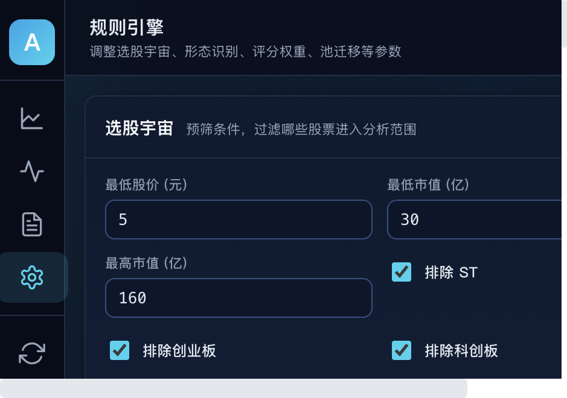

# Alpha — 量化选股漏斗系统

Alpha 是一个面向 A 股市场的量化选股 Web 平台，将多维度数据筛选、实时评分与漏斗管理整合为一体，帮助投资者从数千只股票中高效发现潜力标的。

## 核心功能

| 模块 | 说明 |
|------|------|
| **大盘总览** | 热门概念 Top10（涨幅/涨停数/领涨股）、热门个股 Top10（实时价格/涨跌幅） |
| **策略选股** | 盘后自动筛选调整期未突破股票，三池漏斗管理（候选池 → 重点池 → 买入池） |
| **公告选股** | 抓取当日公告 → 规则打分（+可选 LLM 打分）→ 关键词标签过滤（分红/回购/重组等） |
| **规则引擎** | 可视化查看和调整 35+ 策略参数（选股宇宙、形态识别、评分权重、实时监控等） |
| **K 线缓存** | 每日 15:20 自动同步主板股票日 K（并发调度），同步完成飞书群通知 |
| **实时推送** | WebSocket 实时推送概念行情与个股评分更新 |

## 界面预览

### 大盘总览

热门概念 Top10，展示板块热度、涨停数、上涨/下跌家数等实时行情。


### 策略选股

三池漏斗管理：调整期候选池 → 重点关注池 → 买入池，支持概念筛选和盘后筛选。


### 公告选股

抓取当日公告并智能打分，支持 7 类关键词标签筛选（业绩预增、高额分红、股份回购等）。


### 规则引擎

可视化调整 35+ 策略参数，包括选股宇宙、形态识别、评分权重、池迁移阈值等。



## 技术栈

- **后端**：Python 3.11+ / FastAPI / Uvicorn
- **数据源**：AkShare（A 股行情、公告、概念板块）
- **存储**：SQLite（`data/funnel_state.db` 状态存储 + `data/market_kline.db` K 线缓存）
- **前端**：原生 HTML/CSS/JS + ECharts（K 线图）
- **通知**：飞书 Webhook（同步完成推送）
- **测试**：pytest
- **CI**：GitHub Actions

## 项目结构

```
Alpha/
├── app/
│   ├── main.py                 # FastAPI 入口、后台调度循环
│   ├── config.py               # StrategyConfig（35+ 可调参数）& 规则分组元数据
│   ├── models.py               # Pydantic 数据模型
│   ├── services/
│   │   ├── funnel_service.py   # 策略选股漏斗核心逻辑
│   │   ├── notice_service.py   # 公告选股 & 规则/LLM 打分
│   │   ├── notice_llm.py       # LLM 评分（可选，降级为规则评分）
│   │   ├── kline_cache_service.py  # K 线并发同步调度
│   │   ├── kline_store.py      # K 线 SQLite 存储
│   │   ├── concept_engine.py   # 热门概念计算引擎
│   │   ├── strategy_engine.py  # 盘后策略评分引擎
│   │   ├── data_provider.py    # AkShare 数据适配层
│   │   ├── realtime.py         # WebSocket 实时推送
│   │   ├── feishu_notify.py    # 飞书 Webhook 通知
│   │   ├── sqlite_store.py     # SQLite 状态持久化
│   │   └── time_utils.py       # 中国时区工具
│   └── static/
│       ├── index.html          # 主页面（大盘/策略/公告/规则引擎）
│       ├── app.js              # 前端交互逻辑
│       └── styles.css          # UI 样式
├── strategy/
│   ├── daban.py                # 原始策略脚本
│   ├── daban_2.py              # 策略迭代版本
│   └── daban_3.py              # 策略迭代版本
├── tests/                      # pytest 测试用例
├── start.sh                    # 启动服务
├── stop.sh                     # 停止服务
├── restart.sh                  # 重启服务
└── requirements.txt            # Python 依赖
```

## 快速开始

### 安装依赖

```bash
pip3 install -r requirements.txt
```

### 启动服务

```bash
./start.sh
```

打开浏览器访问 http://127.0.0.1:18888

### 环境变量

| 变量 | 默认值 | 说明 |
|------|--------|------|
| `PORT` | `18888` | 服务端口 |
| `HOST` | `0.0.0.0` | 监听地址 |
| `RELOAD` | `0` | 热重载（开发模式设为 `1`） |
| `OPENAI_API_KEY` | — | 可选，启用公告 LLM 打分 |

### 服务管理

```bash
./start.sh      # 启动（后台运行）
./stop.sh       # 停止
./restart.sh    # 重启（每次代码修改后必须执行）
```

日志文件：`logs/server.log`

## API 接口

### 大盘行情

| 方法 | 路径 | 说明 |
|------|------|------|
| GET | `/api/market/hot-concepts?trade_date=YYYY-MM-DD` | 热门概念 Top10 |
| GET | `/api/market/hot-stocks?trade_date=YYYY-MM-DD` | 热门个股 Top10 |

### 策略选股

| 方法 | 路径 | 说明 |
|------|------|------|
| GET | `/api/funnel?trade_date=YYYY-MM-DD` | 获取漏斗状态 |
| POST | `/api/jobs/eod-screen` | 执行盘后筛选 |
| POST | `/api/pool/move` | 股票迁移池 |
| POST | `/api/score/recompute` | 重新计算评分 |
| GET | `/api/stock/{symbol}/detail` | 个股详情（含K线） |

### 公告选股

| 方法 | 路径 | 说明 |
|------|------|------|
| GET | `/api/notice/funnel` | 公告漏斗状态 |
| GET | `/api/notice/keywords` | 获取关键词标签列表 |
| POST | `/api/jobs/notice-screen?keywords=分红,回购` | 执行公告筛选（支持关键词过滤） |
| POST | `/api/notice/pool/move` | 公告股票迁移池 |
| GET | `/api/notice/{symbol}/detail` | 公告个股详情 |

### K 线缓存

| 方法 | 路径 | 说明 |
|------|------|------|
| GET | `/api/kline/{symbol}?days=30` | 获取个股 K 线 |
| GET | `/api/jobs/kline-cache/status` | 缓存状态 |
| POST | `/api/jobs/kline-cache/sync` | 手动触发同步 |
| GET | `/api/jobs/kline-cache/progress` | 同步进度 |
| GET | `/api/jobs/kline-cache/logs` | 同步日志 |

### 规则引擎

| 方法 | 路径 | 说明 |
|------|------|------|
| GET | `/api/rules/engine` | 获取当前策略参数 |
| POST | `/api/rules/engine` | 更新策略参数 |
| GET | `/api/strategy/profile` | 策略概要信息 |

### 实时推送

| 方法 | 路径 | 说明 |
|------|------|------|
| WS | `/ws/realtime` | WebSocket 实时数据推送 |

## 选股策略说明

### 漏斗三池模型

```
全市场 ──筛选宇宙──▶ 候选池 ──评分升级──▶ 重点池 ──确认买入──▶ 买入池（≤5只）
                    (调整期)            (高分标的)            (最终标的)
```

- **候选池**：盘后筛选出处于调整期、尚未突破的股票
- **重点池**：评分 ≥ 65 或手动升级的标的
- **买入池**：评分 ≥ 80 或手动确认，上限 5 只
- **自动降级**：买入池个股评分连续 5 分钟 < 65 自动降至重点池

### 公告关键词筛选

支持 7 类利好关键词标签选择性筛选：

| 标签 | 匹配关键词 |
|------|-----------|
| 业绩预增 | 预增、扭亏、同比增长、大幅增长、预盈 |
| 高额分红 | 分红、派息、现金红利、利润分配、送转、转增 |
| 股份回购 | 回购、增持计划、增持股份、回购股份 |
| 重大合同 | 重大合同、中标、签订、定点、订单、采购协议 |
| 资产重组 | 重组、收购、并购、资产注入、购买资产 |
| 融资获批 | 获批、审核通过、注册生效、获得批复 |
| 产品突破 | 量产、商业化、获准上市、新品发布、投产 |

不选择任何标签时全部类别参与筛选，选中部分标签则仅按选中类别过滤。仅筛选主板股票（沪市 6 开头、深市 00 开头），自动排除 ST。

## 测试

```bash
pytest -q
```

## License

MIT
