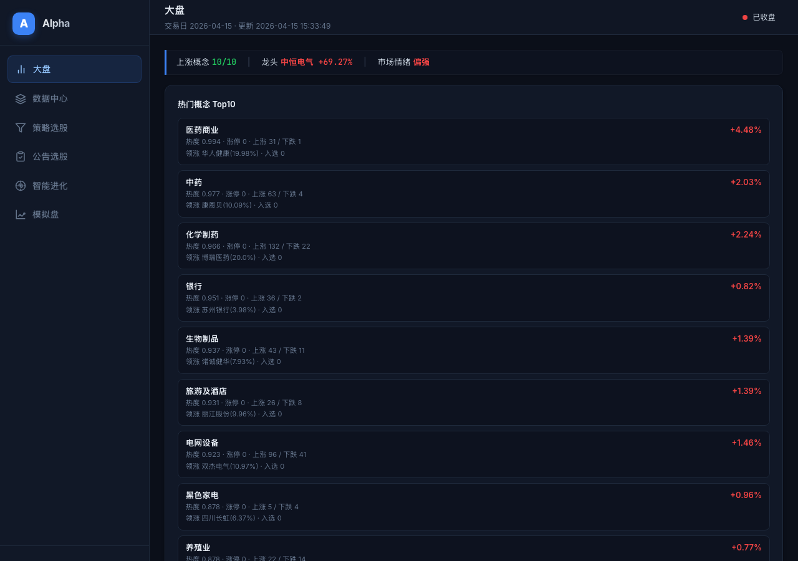
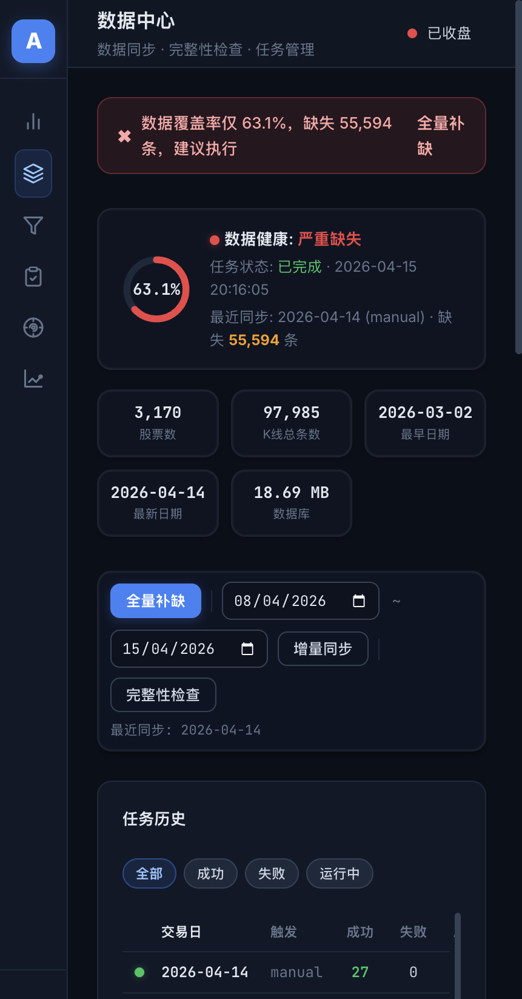
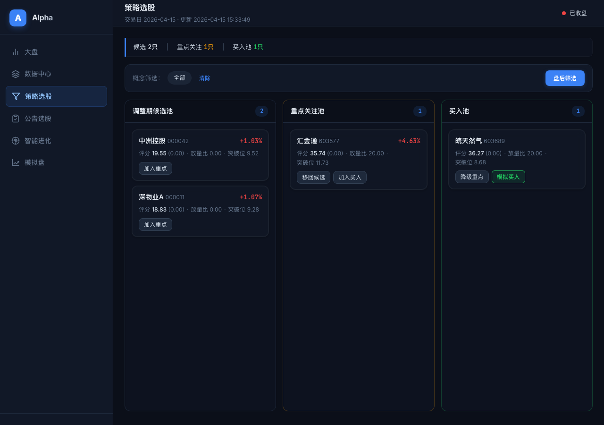
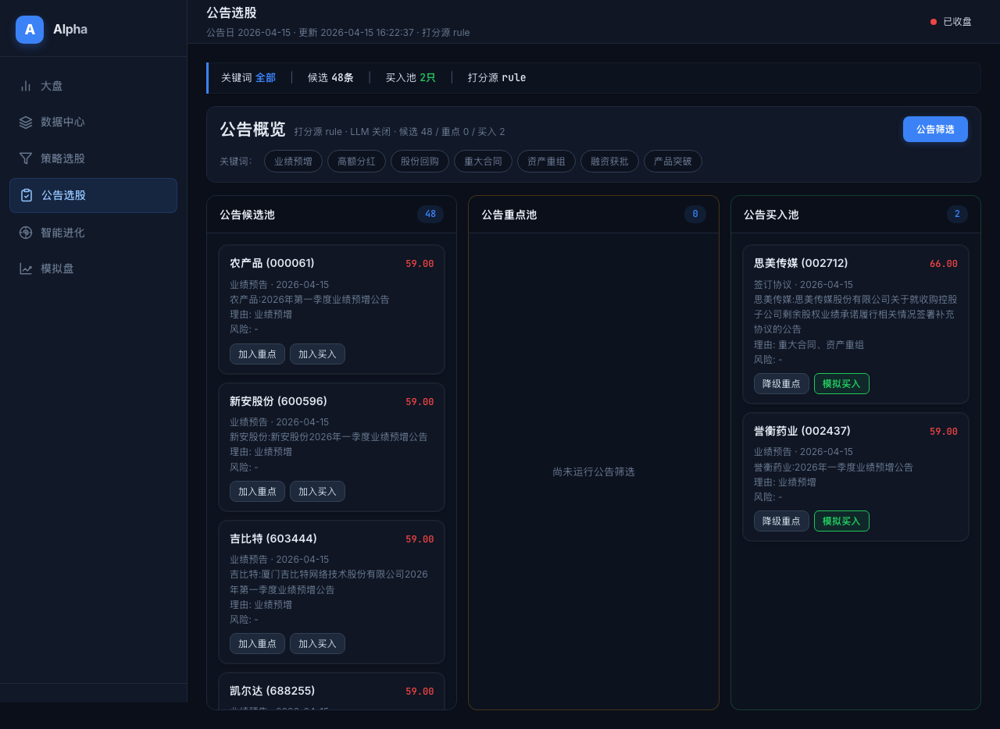
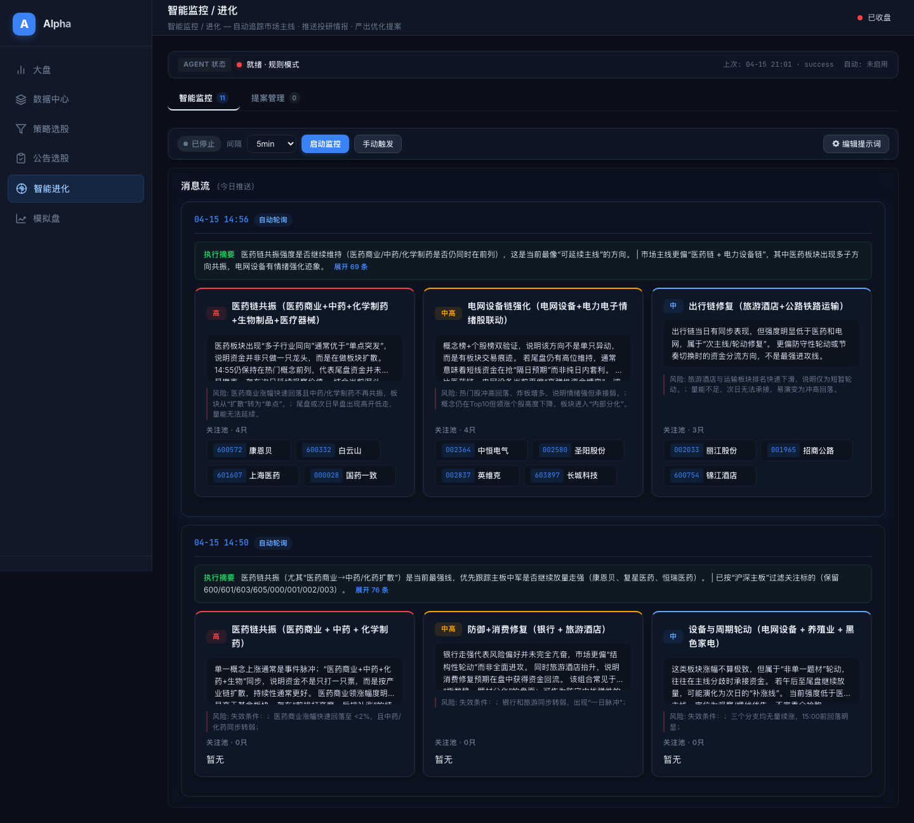
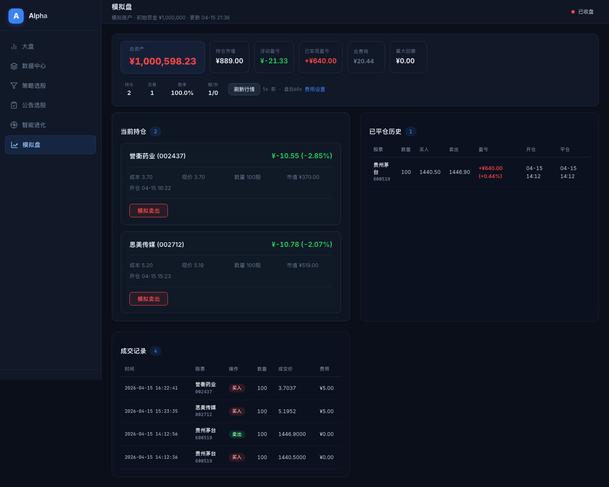
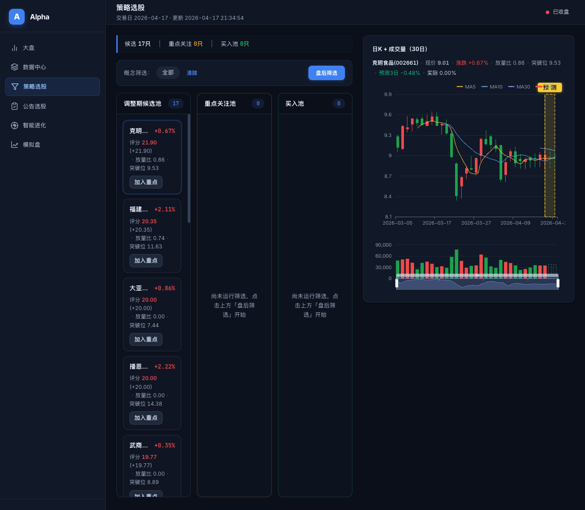

# Alpha — 自进化量化选股系统

<p align="center">
  <strong>A 股量化选股 · Kronos K线预测模型 · Hermes Agent 自进化闭环</strong>
</p>

Alpha 是一个面向 A 股市场的**自进化量化选股系统**。它不只是一个筛选工具——通过集成 **[Kronos](https://arxiv.org/abs/2508.02739) 金融 K 线基础模型**和 **Hermes Agent 自进化智能体**，Alpha 能够自主观察市场、分析主线、输出结构化诊断与交易建议，形成**观察 → 思考 → 校验 → 进化**的持续优化闭环。

---

## 系统架构

```
┌──────────────────────────────────────────────────────────────────────┐
│                         Alpha 系统架构                               │
│                                                                      │
│  ┌─────────────┐    ┌─────────────────────────────────────────────┐  │
│  │  数据层      │    │                 服务层                       │  │
│  │             │    │                                             │  │
│  │  AkShare    │───▶│  KlineCacheService    K线并发同步            │  │
│  │  同花顺     │───▶│  ConceptEngine        概念热度评分           │  │
│  │  新浪财经   │───▶│  StrategyEngine       盘中实时评分           │  │
│  │             │    │  NoticeService        公告抓取+双引擎打分     │  │
│  └─────────────┘    │  FunnelService        三池漏斗状态管理       │  │
│                     │  PaperTradingService   模拟交易引擎           │  │
│  ┌─────────────┐    │                                             │  │
│  │  存储层      │    │  KronosPredictService  K线预测推理           │  │
│  │             │    │  HotStockAIService     热门股智能分析        │  │
│  │             │    │  HermesRuntime         Agent调度+LLM推理     │  │
│  │  SQLite ×2  │◀──▶│  HermesMemory          任务/监控记忆持久化  │  │
│  │  市场K线    │    │                                             │  │
│  │  漏斗状态   │    │                                             │  │
│  └─────────────┘    └───────────────┬─────────────────────────────┘  │
│                                     │                                │
│  ┌─────────────┐    ┌───────────────▼─────────────────────────────┐  │
│  │  Kronos     │    │               接口层                         │  │
│  │  (102.3M)   │    │                                             │  │
│  │  K线基础    │◀──▶│  FastAPI REST API (50+ endpoints)            │  │
│  │  模型       │    │  WebSocket /ws/realtime (snapshot+monitor)   │  │
│  └─────────────┘    │  MCP Server (stdio, 20+ tools → Agent)      │  │
│                     │                                             │  │
│  ┌─────────────┐    └───────────────┬─────────────────────────────┘  │
│  │  Hermes     │                    │                                │
│  │  Agent      │◀──MCP协议──────────┘                                │
│  │  (LLM)      │                                                     │
│  └─────────────┘    ┌─────────────────────────────────────────────┐  │
│                     │               前端层                         │  │
│  ┌─────────────┐    │                                             │  │
│  │  飞书通知    │◀───│  原生HTML/CSS/JS + ECharts 5                 │  │
│  │  Webhook    │    │  9 Tab 单页应用 · Glassmorphism 暗色主题      │  │
│  └─────────────┘    │  10s 实时轮询 + WebSocket 双通道推送          │  │
│                     └─────────────────────────────────────────────┘  │
└──────────────────────────────────────────────────────────────────────┘
```

### 后台调度引擎

系统启动后有 5 个核心后台循环协同工作：

| 循环 | 频率 | 职责 |
|------|------|------|
| **Ticker Loop** | 60s | 调用 `FunnelService.tick()` 刷新漏斗评分，变更时 WebSocket 广播快照 |
| **K线同步 Loop** | 每日 15:20 | 自动检测是否需要同步，并发拉取 3000+ 只股票日 K，完成后飞书通知 |
| **Hermes 调度 Loop** | 300s | 15:30 盘后复盘 · 21:00 公告复盘 |
| **智能监控 Loop** | 30s | 盘中按配置间隔（5~30min）执行 LLM 监控 tick，结果 WebSocket 推送 |
| **热门智能 Loop** | 60s 检查 / 5min 执行 | 检查热门股票智能分析是否过期，按配置自动刷新 Top20 个股，并对前排标的触发 TradingAgents 多代理讨论 |

---

## 界面预览

### 1. 大盘总览

> 一眼掌握市场情绪和热点方向。



- **市场情绪面板**：上涨概念占比、龙头股涨幅、市场情绪等级（偏强/中性/偏弱）
- **热门概念 Top10**：按热度排序，展示涨停/上涨/下跌家数、领涨个股、漏斗入选数
- **热门个股 Top30**：展示最新价、当日涨幅和 10 日累计涨幅，点击可弹出 K 线 + Kronos 预测叠加图
- **实时双通道**：10s 轮询 + WebSocket 服务端主动推送

### 2. 数据中心

> K 线数据的健康管理中枢，保障策略运行的数据基础。



- **健康仪表盘**：环形图展示覆盖率百分比 + 健康等级
- **KPI 指标卡**：股票数、K 线总条数、最早/最新日期、数据库大小
- **同步操作**：全量补缺（日期×股票交叉补全）· 增量同步（仅补当日）· 完整性检查
- **任务历史**：分页展示，支持按状态筛选（全部/成功/失败/运行中）
- **完整性报告**：按日期展示缺失分布，最差个股排名
- **自动同步**：每日 15:20 自动触发并发同步（默认 8 并发），完成后飞书群通知

### 3. 策略选股

> 三池漏斗模型，系统化管理从发现到买入的全流程。



- **复合候选池** → **重点关注池** → **买入池**（上限 5 只）
- **盘后筛选**：`StrategyEngine` 分析箱体幅度、振幅比、缩量、下影支撑等形态
- **盘中评分**：突破强度（35%）+ 量能（25%）+ VWAP/开盘/回撤结构分 — 减分项（高开/冲高回落/近涨停）
- **自动迁池**：评分 ≥ 70 立即升重点，≥ 78 + 量比 ≥ 1.3 + 突破确认升买入；评分连续 5 分钟 < 65 自动降级
- **自适应策略中心**（页面顶部主视觉，取代原"缩量启动"区块）：将选股逻辑抽象为"规则组合"，用户可自由启用 / 关闭单条规则并调参
  - **12 条原子规则**（`app/services/strategy_rules.py`）：价格区间、排除板块、当日涨跌幅、当日涨停、箱体横盘（振幅+量能 CV）、缩量倍数、放量倍数、突破 N 日高、低于 N 日高、站上均线、均线多头排列、距高点回撤
  - **3 条内置策略**（启动时自动写入，不可删除）：
    - `builtin_quiet_breakout` 缩量启动（默认）：价格区间 + 主板 + 箱体 + 放量涨停
    - `builtin_adjustment_box` 调整期横盘：价格区间 + 主板 + 箱体（更宽松）+ 回撤 ≥ 15% + MA60 上方
    - `builtin_breakout_volume` 放量突破新高：价格区间 + 主板 + 均线多头 + 放量 + 突破 60 日新高
  - **规则采用 AND 组合**：所有启用规则全部命中才入选；合成分数 = 匹配率 + 量能/振幅等连续指标加权
  - **一键扫描全 A 股**：约 30 秒扫完 5000 只，结果快照独立持久化 per-strategy
  - **一键 180 天回测**：复用 `BacktestLab.run_custom_strategy`，返回信号数 / 胜率 / 累计收益 / 最大回撤
  - **点击命中卡片**：直接弹出 Kronos 预测 modal（无跳转 / 无刷新 / 无 `window.open`）
  - **布局重排**：策略中心放在策略页上半区；扫描命中结果并入第一个“复合候选池”，下半区继续展示三池
  - 旧 `/api/strategy/quiet-breakout` 端点保留兼容，供 Hermes Agent 工具链和回归用例复用
- **概念筛选**：按板块过滤候选池，聚焦特定赛道
- **右侧面板**：点击个股展示 30 日 K 线 + Kronos 预测叠加

### 4. 公告选股

> 利好公告驱动的事件型选股，规则 + AI 双引擎打分。



- **公告抓取**：自动拉取当日 A 股主板公告（排除 ST / 创业板 / 科创板）
- **规则打分**：7 类利好关键词加权匹配 + 利空关键词压分
- **LLM 打分**（可选）：大模型深度理解公告内容，覆盖规则分数
- **关键词标签**：业绩预增 · 高额分红 · 股份回购 · 重大合同 · 资产重组 · 融资获批 · 产品突破
- **三池管理**：≥ 80 入买入池，≥ 65 入重点池，其余候选
- **右侧 K 线**：嵌入 30 日 K 线 + Kronos 预测

### 5. 热门股票智能分析

> 以实时热门股 Top20 为输入，逐股打分并拆成三池，专门服务情绪龙头和高热度主线。

- **实时输入**：直接复用 `/api/market/hot-stocks` 的实时热门股接口，默认取前 20
- **逐股分析**：结合热度排名、当日涨幅、趋势位置、20 日量额比和 `Kronos` 三日预测
- **深度讨论**：对命中的热门股调用本地 [TradingAgents](</Users/jie.feng/work/github/TradingAgents/README.md>) 项目，通过 `DeepSeek API` 产出多代理讨论结论，再映射为加减分
- **命令行调用方式**：Alpha 通过 `uv run python -m cli.main analyze --ticker ... --date ... --provider deepseek --quick-model deepseek-chat --deep-model deepseek-reasoner` 调用 `TradingAgents`，不再直接 import 图对象
- **解释性评分**：每只股票都输出分数组成、风险扣分、标签和一段摘要分析
- **候选池评价**：`TradingAgents` 返回结果会落到第一池候选池展示，并明确给出 `买入 / 卖出 / 观望` 评价
- **三池拆分**：默认阈值 `8 / 11.5 / 14.5` 分，对应候选 / 重点关注 / 买入候选
- **手动迁池**：候选池卡片复用普通候选池样式，可一键加入重点关注池，并支持重点 / 买入池之间调整
- **自动刷新**：默认每 5 分钟自动扫描一次；为保证站点响应，后台自动任务走轻量模式（缩小样本并跳过 `TradingAgents` / `Kronos`），页面手动触发仍执行完整分析
- **点击个股**：直接弹出历史 K 线 + `Kronos` 三日预测详情

### 6. 图形选股

> 接入 `FirstLimit Alpha` 首板模型，按图形形态和断板风险把首板候选拆成三池。

- **首板候选池** → **重点关注池** → **买入候选池**：默认阈值 `6 / 10 / 14` 分，可通过配置接口调整
- **实时模型接入**：扫描最近交易日首板样本，复用 baseline 模型输出 `first_limit_score / continuation / strong_3d / break_risk`
- **卡片指标**：展示当日涨幅、承接概率、3 日强势概率、断板风险、开盘缺口、20 日量比、涨停质量
- **点击个股**：直接打开详情弹窗，查看历史 K 线并附带 Kronos 三日预测作为辅助判断

### 7. 智能监控 / 进化

> Hermes Agent 驱动的自进化智能体，系统的"大脑"。



- **智能监控 Tab**：
  - 可配置间隔（5/10/15/30 分钟），盘中定时 LLM 分析市场主线
  - 消息按主线分框展示（如"医药链共振"、"电力设备链"），含确信度等级
  - 每条主线下列出关注个股及操作建议
  - 个股标签支持悬停 K 线预览（含 Kronos 预测）
  - 支持手动触发和编辑系统提示词
- **运行记录**：
  - 监控页直接展示最近任务执行结果和状态
  - 支持手动触发 `full_diagnosis`，输出诊断结论但不再触发任何自动变更链路

### 8. 模拟盘

> 零风险验证选股策略的效果。



- **账户总览**：总资产（初始 100 万）、持仓市值、浮动盈亏、已实现盈亏、总费用、最大回撤
- **统计指标**：持仓数、交易数、胜率、胜/负比
- **持仓卡片**：成本/现价/数量/市值/盈亏，一键模拟卖出
- **费用模型**：佣金（默认万 2.5，最低 5 元）+ 印花税 + 滑点，均可自定义
- **实时价格**：下单 / 持仓刷新均走东财 spot（失败自动降级新浪 spot），响应字段附带 `price_source`（`em_live` / `db_fallback` / `stale_cache`）
- **读取降级**：持仓 / 汇总接口优先返回本地模拟盘记录，实时行情超时只影响价格刷新，不阻塞历史持仓和成交记录展示
- **自动刷新**：盘中 30s 轮询，盘后 10min 轮询；页面隐藏时暂停、回到前台自动恢复

### 9. K 线 + Kronos 预测（重点展示）

> **AI 预测与历史 K 线深度融合**，一眼识别未来 3 日走势预判。



- **统一展示窗口**：全站 K 线（大盘/策略/公告/预测/Hermes 监控悬停）均展示最近 **30 根历史 K 线 + 3 根 Kronos 预测**，前端通过 `_sliceMergedForDisplay` 在渲染前截断；Kronos 模型推理仍使用 180 天历史作为输入，不影响预测质量
- **醒目预测区标识**：图表右侧预测段落顶部以**黄底黑字"预 测"**标签带（800 字重 + 黄色辉光）悬浮标注，远距离可辨
- **黄色虚线框圈定**：预测区整体以 `rgba(250,204,21,.14)` 淡黄底色 + 0.75 alpha 虚线边框圈出，与历史 K 线段清晰分界
- **分界竖线**：预测起点处绘制 1.5px 黄色虚线，标识"当前 / 未来"时间分割点
- **信息栏联动**：图表标题旁实时显示「`预测3日 X%` · `实际 X%`」，方便比对 Kronos 预判与真实走势
- **预测 vs 实际叠加**：预测日期真实走出后，系统自动在同一根 K 线位置叠加"实际"蜡烛（legend 可切换），盘中实时偏差一目了然
- **多处一致**：策略选股 / 公告选股 / 大盘热门股弹窗 / Hermes 监控悬停浮窗等所有图表统一使用该 UI 规范

---

## Hermes Agent — 自进化智能体

### 运行模式

Hermes Agent 支持两种运行模式，自动探测并切换：

| 模式 | 条件 | 工作方式 |
|------|------|---------|
| **Agent 模式** | `HERMES_AGENT_URL` 可达 | 发送任务描述 → Agent 自主通过 MCP 工具调用 Alpha API → 返回 JSON 结论 |
| **降级模式** | Agent 不可用 | 内部并行采集数据 → 单次 LLM 调用（OpenAI API）→ 解析 JSON 产出诊断与建议 |

无论哪种模式，都有**并发限制（2）**、**熔断保护（连续 3 次失败冷却 1 小时）**和**超时控制（180s）**。

### 定时任务

| 时间 | 任务 | 说明 |
|------|------|------|
| **15:30** | `daily_review` | 盘后复盘：分析漏斗三池变化、评分表现，输出诊断与后续建议 |
| **21:00** | `notice_review` | 公告复盘：审视当日公告筛选效果，输出规则观察与优化建议 |
| **盘中每 30s** | `risk_guardian` | 监控模拟盘持仓，触发止盈/止损/冲高回落告警（可选自动平仓） |
| **盘中每 60s** | `auto_trade` | 根据 buy 池分数自动下模拟单，到达阈值自动平仓（可开关/Dry Run） |
| **盘中** | 智能监控 | 按间隔执行 LLM 市场分析，推送主线动态到前端 |
| **周五 15:30** | `weekly_report` | 自动生成周报（市场+系统+模拟盘）并推送飞书 |

### Hermes AI 能力扩展（6 项）

前端入口：**智能监控 / 进化 → AI 能力** 子 Tab。

| 代号 | 能力 | 说明 |
|------|------|------|
| **A** | 自动交易闭环 | buy 池分数 ≥70 自动下模拟单 + tp/sl 自动平仓，完整的"选股→决策→执行→复盘"闭环 |
| **B** | 风险守门人 | 盘中 30s 扫描，触发止盈 (+8%)/止损 (-5%)/冲高回落规则，告警卡片可选自动平仓 |
| **C** | 策略回测实验室 | 任意自定义策略（含 3 条内置预设）在全 A 股 × 180 天历史上回测，返回胜率/累计收益/最大回撤（示例：576 信号 / 46% 胜率 / +390% 累计 / 87 秒） |
| **D** | 深度个股研报 | LLM 聚合"K线 + Kronos 预测 + 概念 + 公告"生成 200 字研报卡（含 verdict/confidence/利好/风险/操作建议） |
| **F** | 消息驱动分析 | 把公告+龙虎榜+概念融合 LLM 上下文，输出"消息→标的→操作"链路（含情绪/置信度/理由） |
| **G** | 周报生成 | 周五 15:30 自动汇总一周热门概念/漏斗/模拟盘业绩并推飞书，也可手动触发 |

### 智能监控数据采集

每次监控 tick 通过以下方式采集市场快照：

1. 热门概念 Top10 + 热门个股 → 板块动向
2. 漏斗池所有个股的评分和实时行情 → 持仓视角
3. 买入/重点池个股的 **Kronos 预测**（未来 3 日 OHLC）→ AI 走势预判
4. 公告漏斗关键词和入池个股 → 事件驱动信号
5. K 线缓存健康状态 → 数据完备性确认

采集数据 + 系统提示词 → LLM → 结构化市场主线分析 → WebSocket 推送前端。

### MCP 工具集

Alpha MCP Server（`mcp_server.py`）通过 stdio 协议暴露 20+ 工具，确保 Agent **只能基于真实数据分析，禁止编造**：

| 类别 | 工具 | 说明 |
|------|------|------|
| **漏斗** | `get_funnel_snapshot` · `get_strategy_profile` | 三池状态 + 策略参数快照 |
| **行情** | `get_hot_concepts` · `get_hot_stocks` · `get_stock_detail` · `get_stock_realtime` | 概念/个股/详情/实时 |
| **K 线** | `get_kline` · `get_kline_sync_status` · `get_kline_cache_stats` | 历史 K 线 + 数据健康 |
| **预测** | `predict_kronos` | 调用 Kronos 模型预测并格式化摘要 |
| **公告** | `get_notice_funnel` · `get_notice_keywords` · `get_notice_detail` | 公告筛选数据 |
| **执行** | `get_agent_status` · `list_agent_tasks` · `trigger_eod_screen` · `trigger_notice_screen` | 查询 Agent 状态 / 最近任务 / 主动触发筛选 |

### 记忆系统

| 层级 | 存储 | 内容 |
|------|------|------|
| **任务记忆** | SQLite `agent_tasks` | 任务生命周期：输入、输出、观测数据、工具调用记录 |
| **监控配置** | SQLite `agent_monitor_config` | 监控提示词、间隔、启停状态 |
| **监控消息** | SQLite `agent_monitor_messages` | 盘中主线消息流与推送记录 |

### 自进化闭环

```
   ┌────────────────────────────────────────────┐
   │                                            │
   │   ① 盘中监控 / 盘后复盘                     │
   │   (数据采集 → LLM 分析)                     │
   │          │                                  │
   │          ▼                                  │
   │   ② 发现问题 · 产出洞察                     │
   │   (主线变化/评分异常/策略失效)               │
   │          │                                  │
   │          ▼                                  │
   │   ③ 输出结构化建议                          │
   │   (参数观察 / 风险提示 / 主线复核)          │
   │          │                                  │
   │          ▼                                  │
   │   ④ 人工验证与策略迭代                      │
   │   (结合回测 / 盘中表现自行调整)             │
   │          │                                  │
   │          └──────────▶ 反馈到 ① ─────────────┘
   │
   └────────────────────────────────────────────┘
```

---

## Kronos 金融预测模型

### 关于 Kronos

[Kronos](https://huggingface.co/NeoQuasar/Kronos-base) 是首个开源的金融 K 线基础模型（Foundation Model），由清华大学团队发布（[论文](https://arxiv.org/abs/2508.02739)），在全球 45 个交易所超过 120 亿条 K 线数据上预训练。它将连续的 OHLCV 金融数据视为一种"语言"，通过专用 Tokenizer 将 K 线量化为离散 token 序列，再用自回归 Transformer 学习时间序列的深层模式。

```
历史 K 线 ──Tokenizer──▶ 离散 token 序列 ──Transformer 自回归──▶ 未来 token ──Decoder──▶ 预测 K 线
  (OHLCV)    (量化编码)      (上下文建模)           (逐步生成)    (反量化)     (OHLC)
```

### 在 Alpha 中的全链路集成

Kronos 不是孤立的预测接口，而是**深度嵌入系统每个环节**：

| 场景 | 触发方式 | 说明 |
|------|---------|------|
| **策略选股右侧面板** | 点击个股卡片 | 30 日历史 K 线 + 未来 3 日预测叠加 |
| **公告选股右侧面板** | 点击公告个股 | 事件驱动选股 + AI 走势叠加判断 |
| **大盘热门个股弹窗** | 点击热门个股 | K 线 + Kronos 预测 + 实时行情对比 |
| **监控消息悬停浮窗** | Hover 个股标签 | 轻量级 K 线 + 3 日预测及涨跌预判 |
| **Hermes Agent** | MCP `predict_kronos` | Agent 监控 tick 时获取关注池股票的 AI 走势预判 |
| **预测 vs 实际** | 盘中自动叠加 | 预测 K 线区间叠加实时数据，直观验证准确度 |

预测 K 线在图表中以**黄色半透明虚线框**展示，与历史 K 线无缝衔接。预测区顶部有醒目的**黄底黑字"预 测"标签带**（800 字重 + 黄色辉光），分界处绘制黄色虚线，标题栏同步显示"预测3日 X% · 实际 X%"。完整 UI 效果见 [界面预览 · K 线 + Kronos 预测](#7-k-线--kronos-预测重点展示)。

### 集成架构

```
用户点击 / Hermes Agent MCP 调用 / 监控 tick 数据采集
       │
       ▼
GET /api/predict/{symbol}/kronos?lookback=30&horizon=3
       │
       ▼
KronosPredictService
  ├── asyncio.Lock 串行推理（避免 GPU 竞争）
  ├── 惰性加载模型（首次请求时从 HuggingFace 下载）
  ├── 设备自适应（CUDA → MPS → CPU）
  ├── K 线缓存读取历史 OHLCV
  ├── AkShare 交易日历推算未来交易日
  ├── Tokenizer → Transformer 自回归 → Decoder
  └── 返回 history_kline + predicted_kline + merged_kline
       │
       ▼
前端 ECharts（历史实线 + 预测黄色虚线框 + 盘中实时对比线）
```

### 模型系列

| 模型 | 参数量 | 上下文 | HuggingFace |
|------|--------|--------|-------------|
| Kronos-mini | 4.1M | 2048 | [NeoQuasar/Kronos-mini](https://huggingface.co/NeoQuasar/Kronos-mini) |
| Kronos-small | 24.7M | 512 | [NeoQuasar/Kronos-small](https://huggingface.co/NeoQuasar/Kronos-small) |
| **Kronos-base** | **102.3M** | **512** | [NeoQuasar/Kronos-base](https://huggingface.co/NeoQuasar/Kronos-base) |
| Kronos-large | 499.2M | 512 | 尚未公开 |

Alpha 默认使用 **Kronos-base**（102.3M），推理参数：T=1.0, top_p=0.9, sample_count=100。

### Benchmark（Apple M4 Pro, MPS）

| 模型 | SC=1 | SC=20 | SC=100 |
|------|------|-------|--------|
| **Kronos-mini** (4.1M) | **0.15s** | 0.80s | 0.65s |
| **Kronos-small** (24.7M) | 0.18s | 0.59s | 0.71s |
| **Kronos-base** (102.3M) | 0.27s | 0.76s | 1.34s |

推荐：快速预览 → mini+SC1 · 日常使用 → base+SC20 · 高精度 → base+SC100

```bash
python -m tests.benchmark_kronos  # 复现测试
```

---

## 策略引擎详解

### 选股宇宙预筛

| 参数 | 默认值 | 说明 |
|------|--------|------|
| 股价下限 | ¥5 | 过滤低价股 |
| 市值范围 | 30~160 亿 | 聚焦中盘股 |
| 排除 ST/创业板/科创板 | 是 | 降低风险 |
| 宇宙上限 | 500 只 | 控制计算量 |

### 调整期形态识别

`StrategyEngine.analyze_adjustment_candidate` 分析最近 20 个交易日的 K 线形态：

- **箱体幅度** ≤ 18%（窄幅整理）
- **振幅比** ≤ 95%（波动收敛）
- **缩量** ≤ 75% 前期均量（资金蛰伏）
- **未突破前高**（调整期尚未结束）
- **下影支撑** ≥ 0.5%（底部有承接）
- **追高风险过滤**（涨幅 > 7% 且量比 > 2.3 排除）

### 盘中实时评分（满分 100）

| 维度 | 权重 | 说明 |
|------|------|------|
| 突破强度 | 35% | 价格突破箱体上沿的力度 |
| 量能 | 25% | 成交量相对昨日均额×时间进度 |
| VWAP 之上 | 8% | 高于成交量加权均价 |
| 收 ≥ 开 | 6% | 阳线确认 |
| 回撤可控 | 6% | 未深度回落 |
| 减分：高开 | -8% | 跳空过大，追高风险 |
| 减分：冲高回落 | -6% | 上影线过长 |
| 减分：近涨停 | -6% | 接近涨停板（≥9.2%） |

### 迁池规则

| 方向 | 条件 |
|------|------|
| 候选 → 重点 | 评分 ≥ 60 且连续 3 分钟，或评分 ≥ 70 立即升级 |
| 重点 → 买入 | 评分 ≥ 78 + 量比 ≥ 1.3 + 突破 ×1.003 确认，连续 2 分钟 |
| 买入 → 重点（降级） | 评分连续 5 分钟 < 65 |

---

## FirstLimit Alpha

`FirstLimit Alpha` 是新增的后端策略模块，目标是识别 A 股短线场景下“前期震荡后第一次涨停”的标的，并在首板收盘后给出次日介入评分。

当前版本已在仓库内落地完整研发链路：

- **数据与标签工程**：基于本地 `market_kline.db` 扫描首板样本，产出 `连板延续`、`3 日强势`、`断板风险` 三类标签
- **特征工程**：生成 70+ 个结构化特征，覆盖价格行为、量能、K 线质量、市场情绪和交互项
- **baseline 训练**：默认优先使用 `LightGBM`，自动回退到 `RandomForest`，输出统一 `first_limit_score`
- **时序模型升级**：提供 `GRU` 序列训练入口，用于验证多日序列是否带来增量
- **回测评估**：按交易日 TopK 选股回测，支持持有天数、止盈止损、手续费和滑点
- **FastAPI 接口**：支持数据集构建、特征生成、baseline 训练、序列训练、推理、回测和图形选股快照扫描

模块默认预测时点为：

`首板收盘后决策，次日开盘价作为回测介入价`

这样可以在第一版中严格避免未来函数，并且和现有日线数据能力保持一致。

---

## 飞书卡片推送

所有飞书通知统一使用**交互式卡片**（`msg_type=interactive`），通过 `app/services/feishu_notify.py` 的 `CardBuilder` 构建，视觉风格统一简洁：**色带标题 + KV 网格 + 关键正文 + 灰色备注**。

| 场景 | 触发 | 卡片样式 |
|------|------|---------|
| **K 线同步完成** | 盘后同步任务结束 | 🟢 绿色（0 失败）/ 🟡 黄色（部分失败）/ 🔴 红色（失败 > 5%）· KV 网格展示 成功/失败/总计/耗时 |
| **预测选股 Top 10** | 预测选股任务完成 | 🟣 紫色 · 板块×股票扫描数 · Top 10 个股列表（含预测高/收 % + 板块）|
| **周报** | 周五 15:30 或手动触发 | 🔵 靛蓝 · 标题 + 市场/系统概述 + 热门概念 + 下周关注清单 + 风险提示 |

`CardBuilder` 支持 `add_markdown` / `add_kv_grid` / `add_kv_inline` / `add_hr` / `add_note` / `add_link_button`，业务代码引入后可快速自定义新卡片。

---

## 技术栈

| 层级 | 技术 |
|------|------|
| **后端** | Python 3.11+ · FastAPI · Uvicorn · asyncio |
| **预测模型** | [Kronos-base](https://huggingface.co/NeoQuasar/Kronos-base) 102.3M · PyTorch · HuggingFace Hub |
| **策略建模** | FirstLimit Alpha · LightGBM · scikit-learn · GRU |
| **智能体** | Hermes Agent（CLI `hermes chat -q` / HTTP API）· MCP 协议 · OpenAI 兼容 LLM |
| **数据源** | AkShare（K 线 / 公告 / 交易日历）· 同花顺（热门概念/个股）· 新浪（实时行情 fallback） |
| **存储** | SQLite × 2：`market_kline.db`（K 线缓存）+ `funnel_state.db`（漏斗/持仓/Agent 记忆） |
| **前端** | 原生 HTML/CSS/JS · ECharts 5 · Glassmorphism 暗色主题 · WebSocket 实时推送 |
| **通知** | 飞书 Webhook **交互式卡片**（K 线同步 / 预测选股 / 周报） |

## 项目结构

```
Alpha/
├── app/
│   ├── main.py                        # FastAPI 入口 + 4 个后台调度循环 + 50+ API 路由
│   ├── config.py                      # StrategyConfig 策略参数（50+ 可调参数）
│   ├── models.py                      # Pydantic 请求/响应模型
│   ├── mcp_server.py                  # Alpha MCP Server（20+ 工具 → Hermes Agent）
│   ├── routers/
│   │   ├── kline.py                   # K 线缓存路由 + 自动同步循环
│   │   └── first_limit_alpha.py       # FirstLimit Alpha API 路由
│   └── services/
│       ├── first_limit_alpha_service.py # FirstLimit Alpha 服务编排（数据/特征/训练/推理/回测）
│       ├── kronos_predict_service.py  # Kronos 预测（惰性加载·异步锁·串行推理）
│       ├── kronos_model/              # Kronos 模型实现（Tokenizer + Transformer）
│       ├── hermes_runtime.py          # Agent 调度（双模式·熔断·定时任务·监控tick）
│       ├── hermes_memory.py           # Agent SQLite 持久化（任务/监控）
│       ├── funnel_service.py          # 三池漏斗核心（状态管理·tick·迁池）
│       ├── predict_funnel_service.py   # 预测选股（概念板块×Kronos；板块列表东财重试+同花顺降级）
│       ├── hot_stock_ai_service.py    # 热门股智能分析（Top20·基础评分·TradingAgents讨论·三池拆分）
│       ├── tradingagents_adapter.py   # TradingAgents 适配层（A股代码映射 / 讨论结果抽取）
│       ├── strategy_engine.py         # 盘后形态筛选 + 盘中实时评分
│       ├── strategy_rules.py          # ★ 自定义策略：12 条原子规则（注册表 + 参数 schema + 评估器）
│       ├── custom_strategy.py         # ★ 自定义策略数据模型 + 3 条内置预设 + CustomStrategyScanner
│       ├── quiet_breakout_scanner.py  # 缩量启动扫描（兼容保留，供 legacy API / Hermes 工具复用）
│       ├── concept_engine.py          # 概念热度评分 + 个股板块映射
│       ├── notice_service.py          # 公告抓取 + 规则/LLM 双引擎打分
│       ├── paper_trading.py           # 模拟盘（买入/卖出/持仓/费用计算）
│       ├── kline_cache_service.py     # K 线并发同步调度（缺失矩阵·并发拉取）
│       ├── kline_store.py             # K 线 SQLite 存储
│       ├── data_provider.py           # 多数据源适配（同花顺/新浪/AkShare）
│       ├── realtime.py                # WebSocket 广播（snapshot + monitor_update）
│       ├── time_utils.py              # 交易日/时段/CST 时间工具
│       └── feishu_notify.py           # 飞书 Webhook（交互式卡片 + CardBuilder 构建器）
├── app/static/
│   ├── index.html                     # 9 Tab 单页应用（含热门智能/图形选股）
│   ├── app.js                         # 前端核心（3000+ 行：路由/渲染/轮询/ECharts/WS）
│   └── styles.css                     # Glassmorphism 暗色主题
├── docs/screenshots/                  # 界面截图
├── tests/
│   └── benchmark_kronos.py            # Kronos 性能 benchmark
├── data/                              # SQLite 数据库（运行时生成）
├── strategy/
│   ├── daban.py                       # 旧版打板/强势股脚本
│   ├── daban_2.py                     # 旧版打板策略迭代
│   ├── daban_3.py                     # 旧版打板策略迭代
│   └── first_limit_alpha/
│       ├── README.md                  # 首板介入连板预测模块设计文档
│       └── AI_PROMPTS.md              # 可直接交给 AI 的分阶段实施提示词
│       ├── data_builder.py            # 首板样本扫描 + 标准化训练样本集
│       ├── labeling.py                # 连板延续 / 3日强势 / 断板风险标签
│       ├── features.py                # 结构化特征工程（70+ 特征）
│       ├── modeling.py                # baseline 训练、时间切分、评分融合
│       ├── backtest.py                # TopK 回测 + 风控规则
│       ├── inference.py               # 模型加载与在线打分
│       ├── sequence_dataset.py        # 时序样本构建
│       ├── sequence_model.py          # GRU 时序模型
│       └── train_sequence.py          # 时序训练入口
├── logs/                              # 日志文件
├── start.sh / stop.sh / restart.sh    # 服务管理脚本
└── requirements.txt
```

## 快速开始

### 安装依赖

```bash
pip3 install -r requirements.txt
```

### 启动服务

```bash
./start.sh          # 后台启动
```

打开浏览器访问 http://127.0.0.1:18888

### 环境变量

| 变量 | 默认值 | 说明 |
|------|--------|------|
| `PORT` | `18888` | 服务端口 |
| `HOST` | `0.0.0.0` | 监听地址 |
| `RELOAD` | `0` | 热重载（开发模式设为 `1`） |
| `OPENAI_API_KEY` | — | 启用 LLM 打分 + 智能监控 + Agent 降级模式 |
| `OPENAI_BASE_URL` | — | 自定义 LLM API 端点 |
| `HERMES_MODEL` | — | LLM 模型名称 |
| `HERMES_AGENT_URL` | `http://127.0.0.1:8642/v1` | Hermes Agent HTTP 端点 |
| `FEISHU_WEBHOOK_URL` | — | 飞书群通知 Webhook |

### 服务管理

```bash
./start.sh      # 启动（后台运行）
./stop.sh       # 停止
./restart.sh    # 重启（代码修改后必须执行）
```

日志文件：`logs/server.log`

---

## API 接口

### 大盘行情

| 方法 | 路径 | 说明 |
|------|------|------|
| GET | `/api/market/hot-concepts` | 热门概念 Top10 |
| GET | `/api/market/hot-stocks` | 热门个股 Top30（含当日涨幅与 10 日累计涨幅） |
| GET | `/api/stock/{symbol}/realtime` | 盘中实时行情 |
| GET | `/api/strategy/profile` | 策略配置快照 |

### 策略选股

| 方法 | 路径 | 说明 |
|------|------|------|
| GET | `/api/funnel` | 漏斗三池状态 |
| POST | `/api/jobs/eod-screen` | 盘后筛选 |
| POST | `/api/pool/move` | 股票迁池 |
| POST | `/api/score/recompute` | 重算评分 |
| GET | `/api/stock/{symbol}/detail` | 个股详情（含 K 线） |
| GET | `/api/strategy/rules` | 原子规则目录（12 条，含参数 schema） |
| GET | `/api/strategy/custom` | 自定义策略列表（3 条内置 + 用户创建） |
| GET | `/api/strategy/custom/{id}` | 单条策略详情（含规则引用） |
| POST | `/api/strategy/custom` | 新建 / 更新自定义策略（body 带 `id`/`name`/`description`/`rules`） |
| DELETE | `/api/strategy/custom/{id}` | 删除策略（内置策略返回 403） |
| POST | `/api/strategy/custom/{id}/default` | 将策略设为默认 |
| GET | `/api/strategy/custom/{id}/scan` | 读取最近一次扫描快照 |
| POST | `/api/strategy/custom/{id}/scan` | 触发全 A 股扫描（约 30 秒） |
| POST | `/api/strategy/custom/{id}/backtest` | 对该策略执行 180 天回测（复用 `BacktestLab`） |
| GET | `/api/strategy/hot-stock-ai` | 热门股票智能分析快照（Top20 基础评分 + TradingAgents 讨论增强 + 三池结果） |
| POST | `/api/strategy/hot-stock-ai/run` | 手动触发热门股票智能分析 |
| POST | `/api/strategy/hot-stock-ai/pool/move` | 手动迁移热门智能三池个股（复用 `symbol` / `target_pool` 请求结构） |
| GET | `/api/strategy/hot-stock-ai/config` | 读取热门股票智能分析配置（含 TradingAgents 开关 / TopN / 超时 / 模型） |
| POST | `/api/strategy/hot-stock-ai/config` | 更新热门股票智能分析配置（含 TradingAgents 开关 / TopN / 超时 / 模型） |
| GET | `/api/strategy/quiet-breakout` | **（兼容保留）** 缩量启动最近一次扫描快照 |
| POST | `/api/strategy/quiet-breakout/scan` | **（兼容保留）** 触发全 A 股缩量启动扫描（参数：`lookback_days`/`amp_threshold`/`vol_cv_threshold`/`vol_spike_ratio`/`require_limit_up`） |

### FirstLimit Alpha

| 方法 | 路径 | 说明 |
|------|------|------|
| GET | `/api/strategy/first-limit-alpha/status` | 查看最新数据集 / 特征 / 模型产物状态 |
| POST | `/api/strategy/first-limit-alpha/dataset/build` | 构建首板样本数据集（支持 `start_date` / `end_date`） |
| POST | `/api/strategy/first-limit-alpha/features/build` | 基于最新样本集生成特征文件 |
| POST | `/api/strategy/first-limit-alpha/train/baseline` | 训练 baseline 模型并输出 `first_limit_score` |
| POST | `/api/strategy/first-limit-alpha/train/sequence` | 训练 GRU 时序模型并输出对比结果 |
| POST | `/api/strategy/first-limit-alpha/inference/run` | 对最新或指定交易日样本执行模型打分 |
| POST | `/api/strategy/first-limit-alpha/backtest` | 基于最近一次 baseline 结果执行 TopK 回测 |
| GET | `/api/strategy/first-limit-alpha/graphic` | 读取图形选股三池快照与扫描进度 |
| POST | `/api/strategy/first-limit-alpha/graphic/run` | 手动触发图形选股扫描并刷新三池结果 |
| GET | `/api/strategy/first-limit-alpha/graphic/config` | 读取图形选股阈值配置 |
| POST | `/api/strategy/first-limit-alpha/graphic/config` | 更新图形选股阈值配置 |

### Hermes AI 扩展能力

| 方法 | 路径 | 说明 |
|------|------|------|
| GET  | `/api/hermes-ai/risk` | 风险守门人配置与告警快照 |
| POST | `/api/hermes-ai/risk/config` | 更新 tp/sl/冲高回落阈值 + 自动平仓开关 |
| POST | `/api/hermes-ai/risk/tick` | 立即扫描一次持仓 |
| GET  | `/api/hermes-ai/auto-trade` | 自动交易配置与最近动作 |
| POST | `/api/hermes-ai/auto-trade/config` | 开关启用/dry_run/最多持仓/每笔股数 |
| POST | `/api/hermes-ai/auto-trade/tick` | 立即执行一次自动交易扫描 |
| GET  | `/api/hermes-ai/backtest` | 最近一次回测结果 |
| POST | `/api/hermes-ai/backtest/run` | 触发缩量启动策略在全 A 股 × 180 天上回测 |
| POST | `/api/hermes-ai/research/{symbol}` | 为指定个股生成聚合研报卡 |
| GET  | `/api/hermes-ai/news-insight` | 最近一次消息驱动分析 |
| POST | `/api/hermes-ai/news-insight/run` | 重新生成消息驱动分析 |
| GET  | `/api/hermes-ai/weekly-report` | 最近一次周报 |
| POST | `/api/hermes-ai/weekly-report/run` | 立即生成周报并推飞书 |

### 公告选股

| 方法 | 路径 | 说明 |
|------|------|------|
| GET | `/api/notice/funnel` | 公告漏斗状态 |
| GET | `/api/notice/keywords` | 关键词规则列表 |
| POST | `/api/jobs/notice-screen` | 公告筛选（支持 `keywords` 过滤） |
| POST | `/api/notice/pool/move` | 公告迁池 |
| GET | `/api/notice/{symbol}/detail` | 公告个股详情 |

### Kronos 预测

| 方法 | 路径 | 说明 |
|------|------|------|
| GET | `/api/predict/{symbol}/kronos` | K 线预测（`lookback`=30, `horizon`=3） |
| GET | `/api/predict-funnel` | 预测选股快照（概念板块→成分股→Kronos；东财接口带重试，仍失败时降级同花顺概念名，见 `meta.concept_board_source`：`em` / `ths_names`） |
| POST | `/api/predict-funnel/trigger` | 手动触发预测选股任务 |
| GET | `/api/predict-funnel/config` | 读取预测选股配置 |
| POST | `/api/predict-funnel/config` | 更新预测选股配置 |

### K 线缓存

| 方法 | 路径 | 说明 |
|------|------|------|
| GET | `/api/kline/{symbol}` | 个股 K 线（`days`=30） |
| POST | `/api/jobs/kline-cache/sync` | 全量补缺同步 |
| POST | `/api/jobs/kline-cache/incremental-sync` | 增量同步 |
| POST | `/api/jobs/kline-cache/check` | 完整性检查 |
| GET | `/api/jobs/kline-cache/stats` | 数据库统计 |
| GET | `/api/jobs/kline-cache/status` | 同步状态 |
| GET | `/api/jobs/kline-cache/progress` | 同步进度 |
| GET | `/api/jobs/kline-cache/report` | 完整性报告 |
| GET | `/api/jobs/kline-cache/logs` | 同步日志（分页） |

### 智能监控（Hermes Agent）

| 方法 | 路径 | 说明 |
|------|------|------|
| GET | `/api/agent/status` | Agent 运行状态 |
| POST | `/api/agent/run` | 触发任务（daily_review / notice_review / full_diagnosis） |
| GET | `/api/agent/tasks` | 最近任务列表 |
| GET/POST | `/api/agent/monitor/config` | 监控配置读写 |
| GET | `/api/agent/monitor/messages` | 监控消息流 |
| POST | `/api/agent/monitor/trigger` | 手动触发监控 tick |
| POST | `/api/agent/monitor/stop` | 停止监控 |

### 模拟盘

| 方法 | 路径 | 说明 |
|------|------|------|
| POST | `/api/paper/buy` | 模拟买入 |
| POST | `/api/paper/sell` | 模拟卖出 |
| GET | `/api/paper/positions` | 当前持仓 |
| GET | `/api/paper/history` | 平仓历史 |
| GET | `/api/paper/summary` | 盈亏汇总 |
| GET | `/api/paper/trades` | 成交记录 |
| GET/POST | `/api/paper/settings` | 费用设置 |

### 实时推送

| 方法 | 路径 | 事件类型 | 说明 |
|------|------|---------|------|
| WS | `/ws/realtime` | `snapshot` | 漏斗三池 + 热门概念 + 热门个股 |
| | | `monitor_update` | 智能监控消息推送 |

## 自动化测试

项目内置两套互补的自动化测试：

### 1. API 回归（pytest + httpx）

`tests/test_api_regression.py` — 覆盖 40+ 个端点，分 12 大类：

| 模块 | 用例数 | 覆盖范围 |
|------|--------|---------|
| 静态页面 | 5 | `/`、`/notice`、`/static/*` |
| 大盘行情 | 5 | hot-concepts / hot-stocks / stock detail / realtime |
| 策略漏斗 | 3 | `/api/funnel`、strategy/profile、缩量启动 |
| Kronos 预测 | 4 | predict-funnel + 配置回写 + Kronos 单股预测 |
| K 线缓存 | 6 | stats / status / progress / logs / report / 单股 |
| 公告 | 2 | funnel + keywords |
| Hermes Agent | 4 | status / tasks / 监控 |
| Hermes AI 扩展 | 5 | risk / auto-trade / backtest / news / weekly |
| 模拟盘 | 5 | positions / history / summary / trades / settings |
| 已移除接口 | 8 | proposal / proposal-learner 路由应返回 404 |
| 公告详情 | 1 | 容忍 200/404 |
| 性能巡检 | 5 | 关键只读端点 < 3s |

运行：

```bash
python3 -m pytest tests/test_api_regression.py -v
```

当前结果：以当前仓库实际回归结果为准。

### 2. 前端 E2E（Playwright）

`tests/e2e/ui.spec.js` — 14 个用例，覆盖：

- 7 个 sidebar tab 切换均无 JS 错误
- 自定义策略中心区块视觉尺寸（宽 ≥ 600px、高 ≥ 200px）+ 规则卡片渲染 ≥ 3 张
- **核心 bug 回归**：点击策略命中卡片不触发页面跳转 / 刷新 / `window.open`，且必须正确弹出 Kronos 预测 modal
- 数据中心任务历史表格 grid cell 无水平 overlap（容差 2px）
- 智能进化页不再出现提案管理子 tab
- 模拟盘主容器渲染
- 全站 tab 巡检 0 关键 JS 错误

运行：

```bash
cd tests/e2e
npm install                # 首次
npx playwright install chromium  # 首次
npx playwright test
```

当前结果：**14 / 14 全部通过**。

### 3. 一键运行

```bash
./tests/run_all_tests.sh
```

自动检查后端在线 → 跑 API 回归 → 跑 E2E → 汇总报告（输出到 `tests/test_report.txt`，已 gitignore）。

## License

MIT
