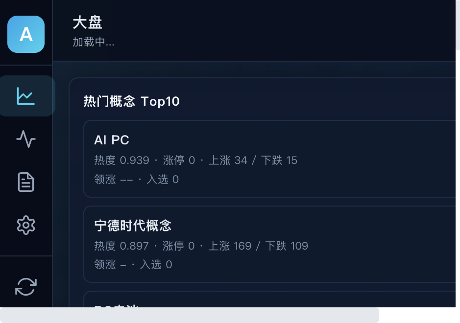
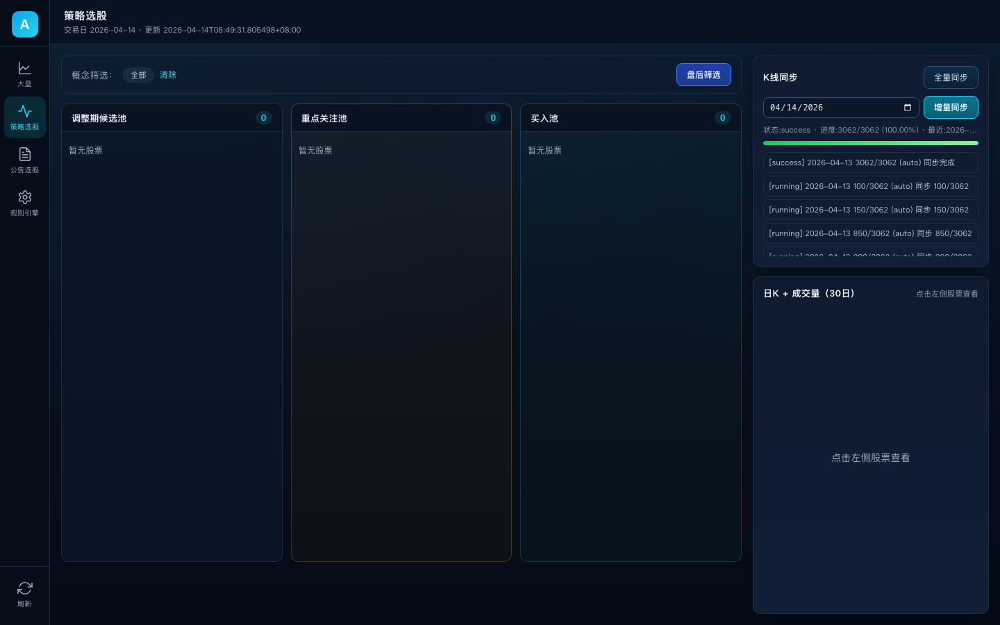
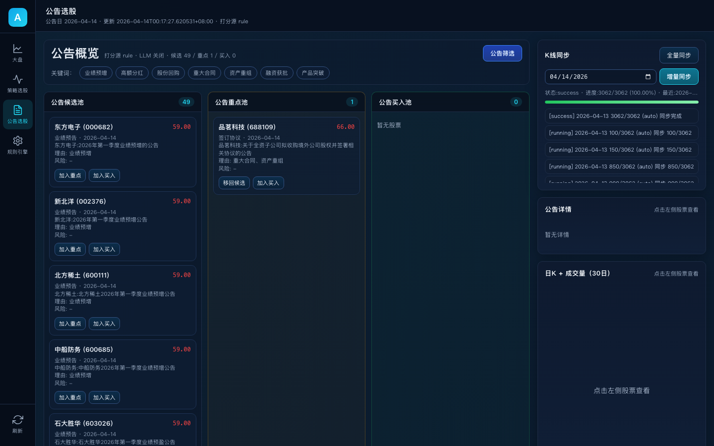
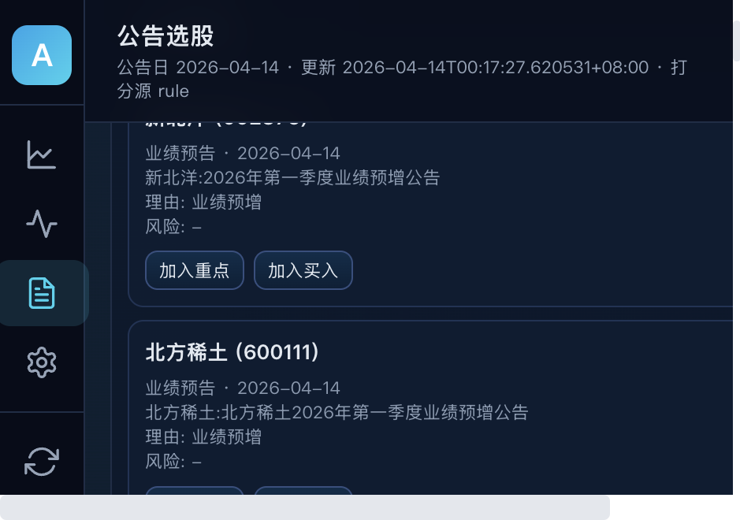

# Alpha — 量化选股漏斗系统

Alpha 是一个面向 A 股市场的量化选股 Web 平台，集成 **[Kronos](https://arxiv.org/abs/2508.02739) 金融 K 线基础模型**进行短期走势预测，将多维度数据筛选、实时评分、AI 价格预测与漏斗管理整合为一体，帮助投资者从数千只股票中高效发现潜力标的。

## 核心功能

| 模块 | 说明 |
|------|------|
| **大盘总览** | 热门概念 Top10（涨幅/涨停数/领涨股）、热门个股 Top10（实时价格/涨跌幅） |
| **策略选股** | 盘后自动筛选调整期未突破股票，三池漏斗管理（候选池 → 重点池 → 买入池） |
| **公告选股** | 抓取当日公告 → 规则打分（+可选 LLM 打分）→ 关键词标签过滤（分红/回购/重组等） |
| **Kronos 预测** | 基于金融 K 线基础模型，输入历史日 K 自回归生成未来多日 OHLC 预测 K 线 |
| **K 线缓存** | 每日 15:20 自动同步主板股票日 K（并发调度），同步完成飞书群通知 |
| **实时推送** | WebSocket 实时推送概念行情与个股评分更新 |

---

## Kronos 金融预测模型

### 关于 Kronos

[Kronos](https://huggingface.co/NeoQuasar/Kronos-base) 是首个开源的金融 K 线基础模型（Foundation Model），由清华大学团队发布（[论文](https://arxiv.org/abs/2508.02739)），在全球 45 个交易所超过 120 亿条 K 线数据上预训练。它将连续的 OHLCV 金融数据视为一种"语言"，通过专用 tokenizer 将 K 线量化为离散 token 序列，再用自回归 Transformer 学习时间序列的深层模式。

```
历史 K 线 ──Tokenizer──▶ 离散 token 序列 ──Transformer 自回归──▶ 未来 token ──Decoder──▶ 预测 K 线
  (OHLCV)    (量化编码)      (上下文建模)           (逐步生成)    (反量化)     (OHLC)
```

### 模型系列

Kronos 提供从轻量到大规模的一系列模型，适配不同算力场景：

| 模型 | 参数量 | Tokenizer | 上下文长度 | HuggingFace |
|------|--------|-----------|-----------|-------------|
| Kronos-mini | 4.1M | [Kronos-Tokenizer-2k](https://huggingface.co/NeoQuasar/Kronos-Tokenizer-2k) | 2048 | [NeoQuasar/Kronos-mini](https://huggingface.co/NeoQuasar/Kronos-mini) |
| Kronos-small | 24.7M | [Kronos-Tokenizer-base](https://huggingface.co/NeoQuasar/Kronos-Tokenizer-base) | 512 | [NeoQuasar/Kronos-small](https://huggingface.co/NeoQuasar/Kronos-small) |
| **Kronos-base** | **102.3M** | [Kronos-Tokenizer-base](https://huggingface.co/NeoQuasar/Kronos-Tokenizer-base) | **512** | [NeoQuasar/Kronos-base](https://huggingface.co/NeoQuasar/Kronos-base) |
| Kronos-large | 499.2M | Kronos-Tokenizer-base | 512 | 尚未公开 |

Alpha 当前默认使用 **Kronos-base**（102.3M 参数），可在 `app/services/kronos_predict_service.py` 中切换。

### 集成架构

```
用户点击股票卡片
       │
       ▼
GET /api/predict/{symbol}/kronos?lookback=30&horizon=3
       │
       ▼
KronosPredictService（惰性加载、异步锁、串行推理）
  ├── 从 K 线缓存读取历史 OHLCV
  ├── 交易日历推算未来交易日
  ├── Tokenizer 编码 → Transformer 自回归推理 → Decoder 解码
  └── 返回历史 + 预测 K 线合并序列
       │
       ▼
前端 ECharts 渲染弹窗：历史 K 线 + 预测 K 线（黄色半透明区域）
```

集成要点：

- **惰性加载**：模型在首次预测请求时从 HuggingFace Hub 下载并加载，不阻塞服务启动
- **设备自适应**：自动检测 CUDA → MPS（Apple Silicon）→ CPU，优先使用 GPU 加速
- **异步隔离**：推理通过 `asyncio.to_thread` 在线程池执行，不阻塞 FastAPI 事件循环
- **交易日推算**：基于 AkShare 交易日历自动推算预测对应的真实交易日，跳过周末和节假日

### 预测 API

```
GET /api/predict/{symbol}/kronos?lookback=30&horizon=3
```

| 参数 | 类型 | 默认值 | 说明 |
|------|------|--------|------|
| `symbol` | path | — | 股票代码（如 `000001`） |
| `lookback` | query | 30 | 历史 K 线天数（10-200） |
| `horizon` | query | 3 | 预测天数（1-10） |

返回示例（简化）：

```json
{
  "symbol": "000001",
  "model": "Kronos-base",
  "device": "mps",
  "lookback": 30,
  "horizon": 3,
  "history_kline": [ { "date": "2026-04-11", "open": 11.05, "close": 11.07, "type": "history" } ],
  "predicted_kline": [ { "date": "2026-04-14", "open": 11.06, "close": 11.09, "type": "predicted" } ],
  "merged_kline": [ "...history + predicted..." ],
  "prediction_start_index": 30
}
```

### Benchmark

以下是 Kronos 系列模型在 A 股日 K 预测场景下的性能实测。

**测试条件**：000001（平安银行）/ lookback=30 / horizon=5 / Apple MPS / T=1.0, top_p=0.9 / 预热 1 次后取 3 次均值

| 模型 | 参数量 | 加载耗时 | 推理耗时 | D1 预测涨跌 | D5 预测涨跌 | 预测波动率 |
|------|--------|---------|---------|------------|------------|-----------|
| **Kronos-mini** | 4.1M | 1.36s | **0.16s** | -0.12% | +0.27% | 1.30% |
| **Kronos-small** | 24.7M | 1.57s | 0.25s | -0.11% | +1.16% | 0.98% |
| **Kronos-base** | 102.3M | 3.14s | 0.27s | -0.05% | -1.89% | 1.35% |
| Kronos-large | 499.2M | — | — | — | — | — |

> Kronos-large 尚未公开发布。预测结果含随机采样，每次运行有差异。

**结论**：

- **推理速度**：三个模型推理均在亚秒级（0.16s ~ 0.27s），日 K 场景下差异不大
- **加载代价**：Kronos-base 首次加载约 3s，模型常驻内存后不再重复加载
- **模型选择**：项目默认使用 Kronos-base 以平衡预测质量与资源占用；如需更快响应可切换为 mini

运行 benchmark：

```bash
python -m tests.benchmark_kronos
```

---

## 界面预览

### 大盘总览

热门概念 Top10，展示板块热度、涨停数、上涨/下跌家数等实时行情。



### 策略选股

三池漏斗管理：调整期候选池 → 重点关注池 → 买入池，支持概念筛选和盘后筛选。



### 公告选股

抓取当日公告并智能打分，支持 7 类关键词标签筛选（业绩预增、高额分红、股份回购等）。





## 技术栈

- **后端**：Python 3.11+ / FastAPI / Uvicorn
- **预测模型**：[Kronos](https://huggingface.co/NeoQuasar/Kronos-base)（PyTorch, HuggingFace Hub）
- **数据源**：AkShare（A 股行情、公告、概念板块）
- **存储**：SQLite（`data/funnel_state.db` 状态存储 + `data/market_kline.db` K 线缓存）
- **前端**：原生 HTML/CSS/JS + ECharts（K 线图 + 预测可视化）
- **通知**：飞书 Webhook（同步完成推送）
- **测试**：pytest
- **CI**：GitHub Actions

## 项目结构

```
Alpha/
├── app/
│   ├── main.py                    # FastAPI 入口、后台调度循环
│   ├── config.py                  # StrategyConfig（策略参数配置）
│   ├── models.py                  # Pydantic 数据模型
│   ├── services/
│   │   ├── kronos_predict_service.py  # Kronos 预测服务（惰性加载、异步推理）
│   │   ├── kronos_model/          # Kronos 模型实现（Tokenizer + Transformer + Predictor）
│   │   ├── funnel_service.py      # 策略选股漏斗核心逻辑
│   │   ├── notice_service.py      # 公告选股 & 规则/LLM 打分
│   │   ├── kline_cache_service.py # K 线并发同步调度
│   │   ├── kline_store.py         # K 线 SQLite 存储
│   │   ├── strategy_engine.py     # 盘后策略评分引擎
│   │   ├── data_provider.py       # AkShare 数据适配层
│   │   ├── realtime.py            # WebSocket 实时推送
│   │   └── ...
│   └── static/                    # 前端（HTML/CSS/JS + ECharts）
├── tests/
│   ├── benchmark_kronos.py        # Kronos 模型 benchmark 脚本
│   └── ...
├── start.sh / stop.sh / restart.sh
└── requirements.txt
```

## 快速开始

### 安装依赖

```bash
pip3 install -r requirements.txt
```

### 启动服务

```bash
./start.sh
```

打开浏览器访问 http://127.0.0.1:18888

### 环境变量

| 变量 | 默认值 | 说明 |
|------|--------|------|
| `PORT` | `18888` | 服务端口 |
| `HOST` | `0.0.0.0` | 监听地址 |
| `RELOAD` | `0` | 热重载（开发模式设为 `1`） |
| `OPENAI_API_KEY` | — | 可选，启用公告 LLM 打分 |

### 服务管理

```bash
./start.sh      # 启动（后台运行）
./stop.sh       # 停止
./restart.sh    # 重启（每次代码修改后必须执行）
```

日志文件：`logs/server.log`

## API 接口

### Kronos 预测

| 方法 | 路径 | 说明 |
|------|------|------|
| GET | `/api/predict/{symbol}/kronos?lookback=30&horizon=3` | Kronos K 线预测 |

### 大盘行情

| 方法 | 路径 | 说明 |
|------|------|------|
| GET | `/api/market/hot-concepts?trade_date=YYYY-MM-DD` | 热门概念 Top10 |
| GET | `/api/market/hot-stocks?trade_date=YYYY-MM-DD` | 热门个股 Top10 |

### 策略选股

| 方法 | 路径 | 说明 |
|------|------|------|
| GET | `/api/funnel?trade_date=YYYY-MM-DD` | 获取漏斗状态 |
| POST | `/api/jobs/eod-screen` | 执行盘后筛选 |
| POST | `/api/pool/move` | 股票迁移池 |
| POST | `/api/score/recompute` | 重新计算评分 |
| GET | `/api/stock/{symbol}/detail` | 个股详情（含K线） |

### 公告选股

| 方法 | 路径 | 说明 |
|------|------|------|
| GET | `/api/notice/funnel` | 公告漏斗状态 |
| GET | `/api/notice/keywords` | 获取关键词标签列表 |
| POST | `/api/jobs/notice-screen?keywords=分红,回购` | 执行公告筛选（支持关键词过滤） |
| POST | `/api/notice/pool/move` | 公告股票迁移池 |
| GET | `/api/notice/{symbol}/detail` | 公告个股详情 |

### K 线缓存

| 方法 | 路径 | 说明 |
|------|------|------|
| GET | `/api/kline/{symbol}?days=30` | 获取个股 K 线 |
| POST | `/api/jobs/kline-cache/sync` | 手动触发同步 |
| GET | `/api/jobs/kline-cache/progress` | 同步进度 |
| GET | `/api/jobs/kline-cache/logs` | 同步日志 |

### 其他

| 方法 | 路径 | 说明 |
|------|------|------|
| GET | `/api/strategy/profile` | 策略概要信息 |
| WS | `/ws/realtime` | WebSocket 实时数据推送 |

## 选股策略说明

### 漏斗三池模型

```
全市场 ──筛选宇宙──▶ 候选池 ──评分升级──▶ 重点池 ──确认买入──▶ 买入池（≤5只）
                    (调整期)            (高分标的)            (最终标的)
```

- **候选池**：盘后筛选出处于调整期、尚未突破的股票
- **重点池**：评分 ≥ 65 或手动升级的标的
- **买入池**：评分 ≥ 80 或手动确认，上限 5 只
- **自动降级**：买入池个股评分连续 5 分钟 < 65 自动降至重点池

### 公告关键词筛选

支持 7 类利好关键词标签选择性筛选：

| 标签 | 匹配关键词 |
|------|-----------|
| 业绩预增 | 预增、扭亏、同比增长、大幅增长、预盈 |
| 高额分红 | 分红、派息、现金红利、利润分配、送转、转增 |
| 股份回购 | 回购、增持计划、增持股份、回购股份 |
| 重大合同 | 重大合同、中标、签订、定点、订单、采购协议 |
| 资产重组 | 重组、收购、并购、资产注入、购买资产 |
| 融资获批 | 获批、审核通过、注册生效、获得批复 |
| 产品突破 | 量产、商业化、获准上市、新品发布、投产 |

不选择任何标签时全部类别参与筛选，选中部分标签则仅按选中类别过滤。仅筛选主板股票（沪市 6 开头、深市 00 开头），自动排除 ST。

## 测试

```bash
pytest -q
```

## License

MIT
